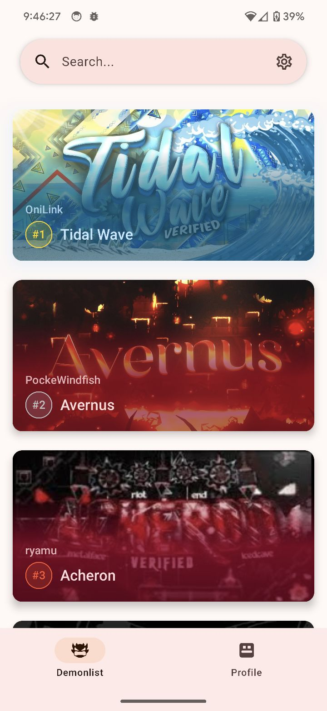
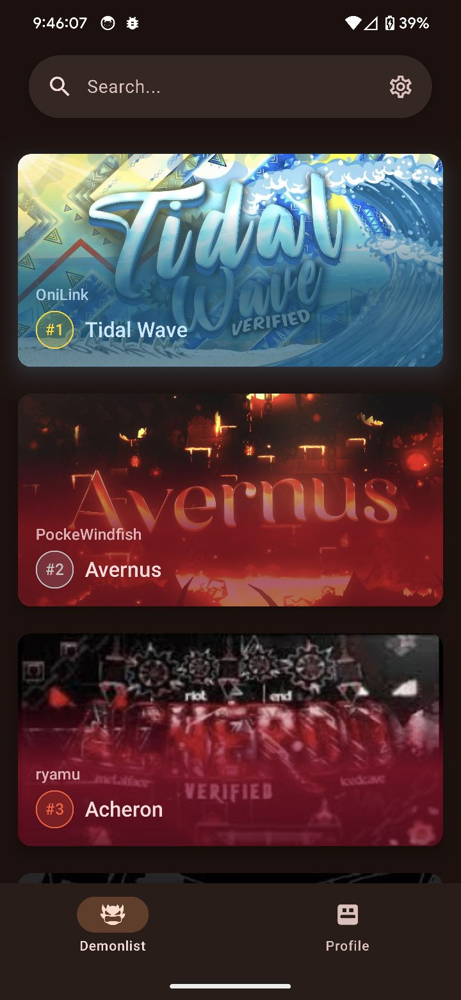

  

   # Hellish
   An Android client for the Pointercrate demonlist

   
   
   

   

   | Light                                                                                       | Dark                                                                                      |
   |---------------------------------------------------------------------------------------------|-------------------------------------------------------------------------------------------|
   |  |  |

Contribute
---
If you're unfamiliar with programming but would still like to help you can by doing one of the following:
- [Testing early builds and reporting issues](https://github.com/wingio/Hellish/issues/new)
- [Translating the app into your language](https://crowdin.com/project/hellish)

Otherwise if you do want to contribute code then it's preferred that you're familiar with the following technologies:
- Kotlin
- Android SDK
- Koin DI
- Jetpack Compose
  - Voyager
- The Pointercrate API
  - Ktor (Client)
  - Kotlinx Serialization

Build
---

#### Prerequisites
- [Git](https://git-scm.com/downloads)
- [JDK 17](https://www.oracle.com/java/technologies/javase/jdk17-archive-downloads.html)
- [Android SDK](https://developer.android.com/studio)

#### Instructions

1. Clone the repo
    - `git clone https://github.com/wingio/Hellish.git && cd Hellish`
2. Build the project
    - Linux: `chmod +x ./gradlew && gradlew assembleDebug`
    - Windows: `./gradlew assembleDebug`
3. Install on device
    - [Enable usb debugging](https://developer.android.com/studio/debug/dev-options) and plug in your phone
    - Run `adb install app/build/outputs/apk/debug/app-debug.apk`

License
---
Hellish is licensed under the GNU General Public License v3.0

